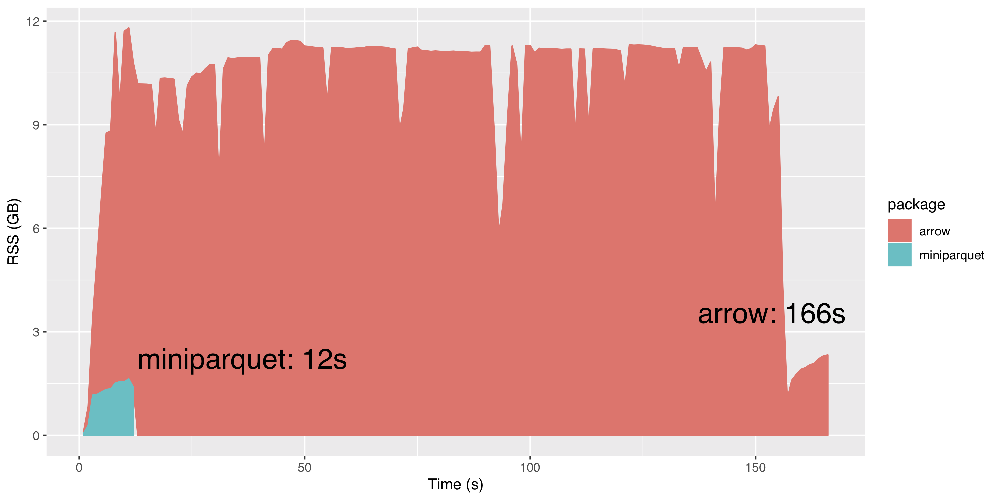

# miniparquet

`miniparquet` is a reader for a common subset of Parquet files. miniparquet only supports rectangular-shaped data structures (no nested tables) and only the Snappy compression scheme. miniparquet has no (zero, none, 0) [external dependencies](https://research.swtch.com/deps) and is very lightweight. It compiles in seconds to a binary size of under 1 MB. 

## Installation
Miniparquet comes as both a C++ library and a R package. Install the R package like so: `devtools::install_github("hannesmuehleisen/miniparquet")` 

The C++ library can be built by typing `make`.

## Usage
Use the R package like so: `df <- miniparquet::parquet_read("example.parquet")` 

Folders of similar-structured Parquet files (e.g. produced by Spark) can be read like this: 

`df <- data.table::rbindlist(lapply(Sys.glob("some-folder/part-*.parquet"), miniparquet::parquet_read))`

If you find a file that should be supported but isn't, please open an issue here with a link to the file. 

## Performance
`miniparquet` is quite fast, on my laptop (I7-4578U) it can read compressed Parquet files at over 200 MB/s using only a single thread. The only other package that can read Parquet files from R is the recent `arrow` package. Below is a performance comparision with the current CRAN version (0.14.1.1). We have loaded a 220 MB Parquet file containing ~ 6 M rows of the TPC-H lineitem table. The file was created with Spark and is available [for download](https://homepages.cwi.nl/~hannes/lineitem-subset.snappy.parquet). 

The following picture shows time on the X axis and memory usage (RSS) on the Y axis.

